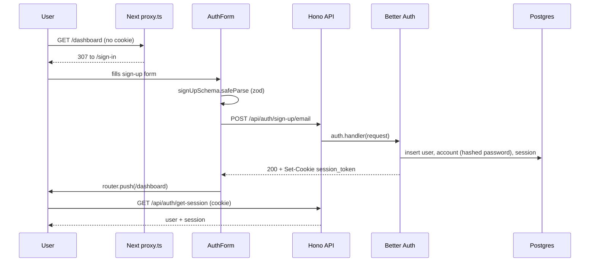
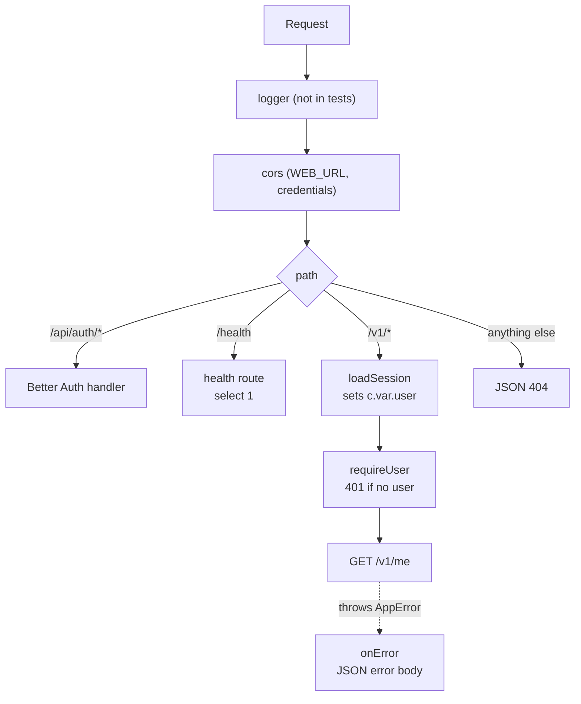

# Request flow: sign-up and an authenticated request

```mermaid
sequenceDiagram
  participant U as User
  participant P as Next proxy.ts
  participant F as AuthForm
  participant A as Hono API
  participant BA as Better Auth
  participant DB as Postgres

  U->>P: GET /dashboard (no cookie)
  P-->>U: 307 to /sign-in
  U->>F: fills sign-up form
  F->>F: signUpSchema.safeParse (zod)
  F->>A: POST /api/auth/sign-up/email
  A->>BA: auth.handler(request)
  BA->>DB: insert user, account (hashed password), session
  BA-->>F: 200 + Set-Cookie session_token
  F->>U: router.push(/dashboard)
  U->>A: GET /api/auth/get-session (cookie)
  A-->>U: user + session
```

## Middleware order in `createApp`

```mermaid
flowchart TD
  R["Request"] --> L["logger (not in tests)"]
  L --> C["cors (WEB_URL, credentials)"]
  C --> X{path}
  X -- "/api/auth/*" --> BA["Better Auth handler"]
  X -- "/health" --> H["health route<br/>select 1"]
  X -- "/v1/*" --> S["loadSession<br/>sets c.var.user"]
  S --> RU["requireUser<br/>401 if no user"]
  RU --> ME["GET /v1/me"]
  X -- "anything else" --> NF["JSON 404"]
  ME -. "throws AppError" .-> E["onError<br/>JSON error body"]
```
