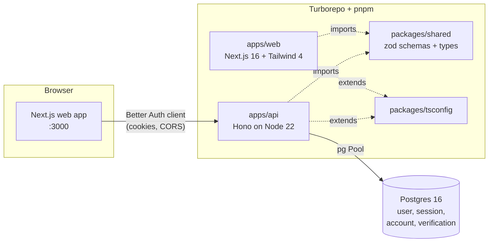

# System overview (Chapter 1)

```mermaid
flowchart LR
  subgraph Browser
    W["Next.js web app<br/>:3000"]
  end
  subgraph Monorepo["Turborepo + pnpm"]
    WEB["apps/web<br/>Next.js 16 + Tailwind 4"]
    API["apps/api<br/>Hono on Node 22"]
    SH["packages/shared<br/>zod schemas + types"]
    TS["packages/tsconfig"]
  end
  W -- "Better Auth client<br/>(cookies, CORS)" --> API
  API -- "pg Pool" --> PG[("Postgres 16<br/>user, session,<br/>account, verification")]
  WEB -. imports .-> SH
  API -. imports .-> SH
  WEB -. extends .-> TS
  API -. extends .-> TS
```

Later chapters add `apps/worker` (Chapter 6), Redis + BullMQ (Chapter 6) and
Docker language images (Chapter 3).
