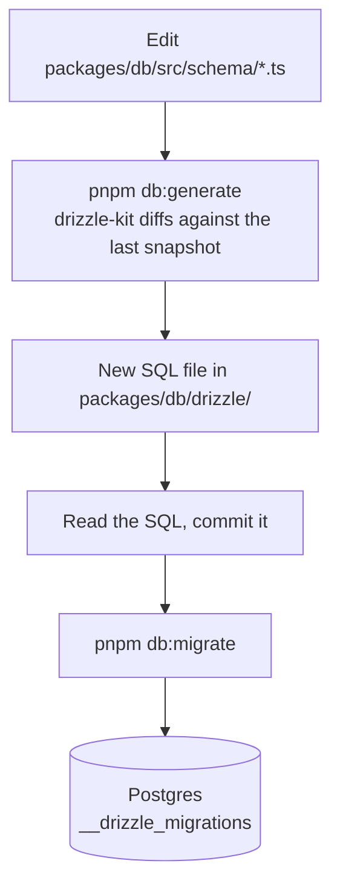
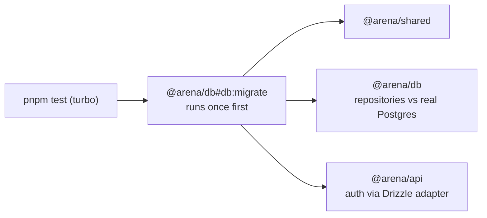
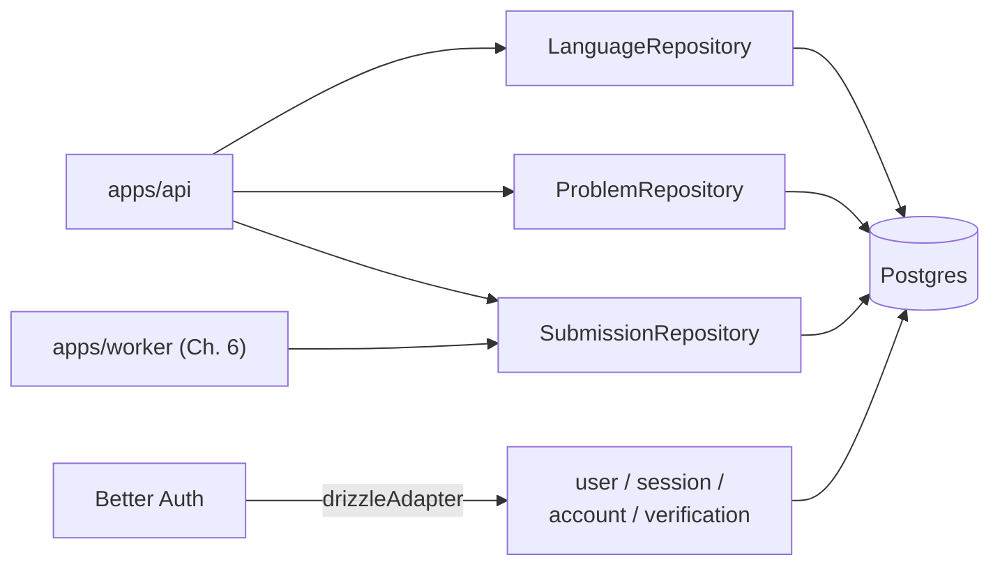

# Integration flow: schema changes, setup and tests

```mermaid
flowchart TD
  A["Edit packages/db/src/schema/*.ts"] --> B["pnpm db:generate<br/>drizzle-kit diffs against the last snapshot"]
  B --> C["New SQL file in packages/db/drizzle/"]
  C --> D["Read the SQL, commit it"]
  D --> E["pnpm db:migrate"]
  E --> F[("Postgres<br/>__drizzle_migrations")]
```

```mermaid
flowchart LR
  T["pnpm test (turbo)"] --> M["@arena/db#db:migrate<br/>runs once first"]
  M --> S["@arena/shared"]
  M --> D["@arena/db<br/>repositories vs real Postgres"]
  M --> A["@arena/api<br/>auth via Drizzle adapter"]
```

## Who uses which repository

```mermaid
flowchart LR
  API["apps/api"] --> LR["LanguageRepository"]
  API --> PR["ProblemRepository"]
  API --> SR["SubmissionRepository"]
  W["apps/worker (Ch. 6)"] --> SR
  BA["Better Auth"] -- drizzleAdapter --> AUTH["user / session /<br/>account / verification"]
  LR & PR & SR --> DB[("Postgres")]
  AUTH --> DB
```
