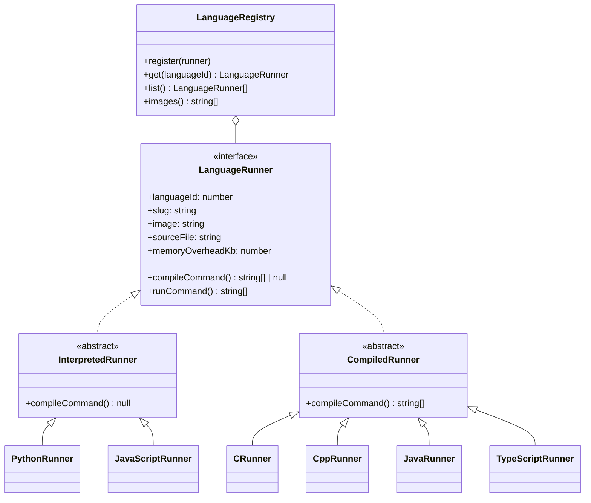
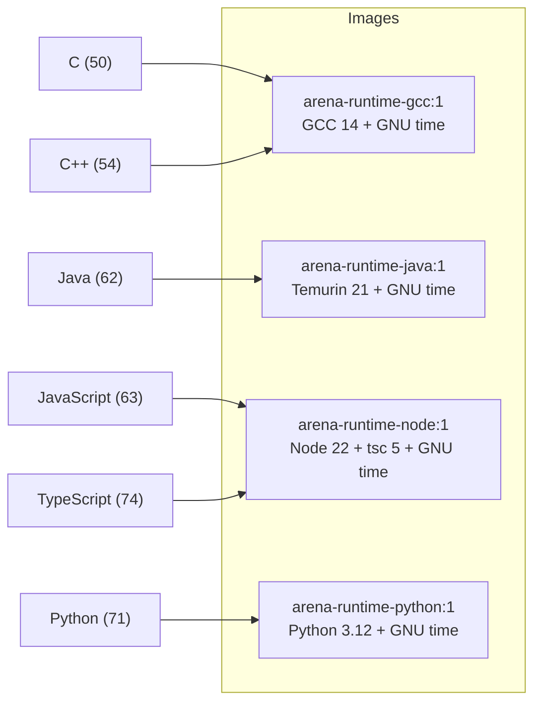

# Language runtimes (Chapter 3)

```mermaid
classDiagram
  class LanguageRunner {
    <<interface>>
    +languageId: number
    +slug: string
    +image: string
    +sourceFile: string
    +memoryOverheadKb: number
    +compileCommand() string[] | null
    +runCommand() string[]
  }
  class InterpretedRunner {
    <<abstract>>
    +compileCommand() null
  }
  class CompiledRunner {
    <<abstract>>
    +compileCommand() string[]
  }
  class LanguageRegistry {
    +register(runner)
    +get(languageId) LanguageRunner
    +list() LanguageRunner[]
    +images() string[]
  }
  LanguageRunner <|.. InterpretedRunner
  LanguageRunner <|.. CompiledRunner
  InterpretedRunner <|-- PythonRunner
  InterpretedRunner <|-- JavaScriptRunner
  CompiledRunner <|-- CRunner
  CompiledRunner <|-- CppRunner
  CompiledRunner <|-- JavaRunner
  CompiledRunner <|-- TypeScriptRunner
  LanguageRegistry o-- LanguageRunner
```

```mermaid
flowchart LR
  subgraph Images
    G["arena-runtime-gcc:1<br/>GCC 14 + GNU time"]
    J["arena-runtime-java:1<br/>Temurin 21 + GNU time"]
    N["arena-runtime-node:1<br/>Node 22 + tsc 5 + GNU time"]
    P["arena-runtime-python:1<br/>Python 3.12 + GNU time"]
  end
  C["C (50)"] --> G
  CPP["C++ (54)"] --> G
  JAVA["Java (62)"] --> J
  JS["JavaScript (63)"] --> N
  TS["TypeScript (74)"] --> N
  PY["Python (71)"] --> P
```
