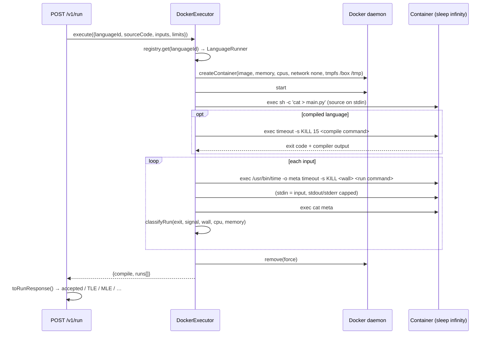
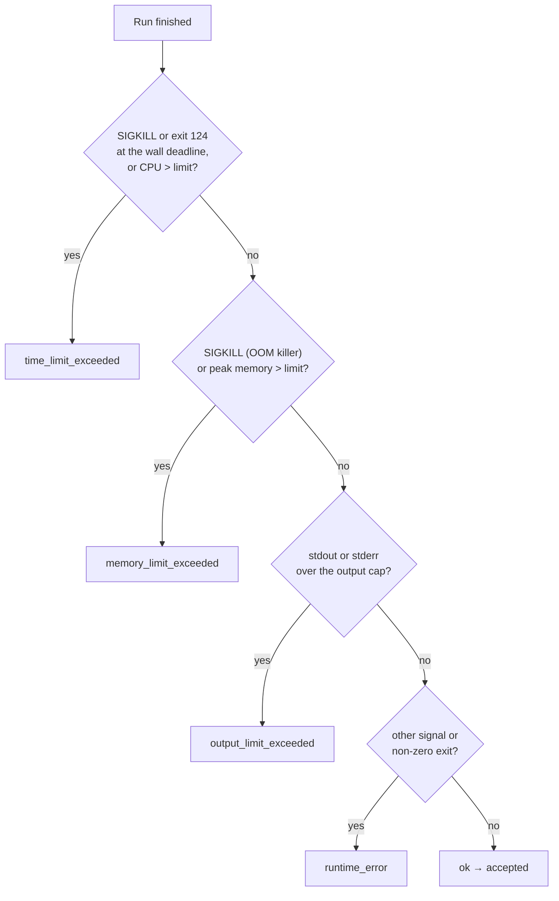

# Executor flow (Chapter 4)

```mermaid
sequenceDiagram
  participant API as POST /v1/run
  participant EX as DockerExecutor
  participant D as Docker daemon
  participant C as Container (sleep infinity)

  API->>EX: execute({languageId, sourceCode, inputs, limits})
  EX->>EX: registry.get(languageId) → LanguageRunner
  EX->>D: createContainer(image, memory, cpus, network none, tmpfs /box /tmp)
  EX->>D: start
  EX->>C: exec sh -c 'cat > main.py' (source on stdin)
  opt compiled language
    EX->>C: exec timeout -s KILL 15 <compile command>
    C-->>EX: exit code + compiler output
  end
  loop each input
    EX->>C: exec /usr/bin/time -o meta timeout -s KILL <wall> <run command>
    EX->>C: (stdin = input, stdout/stderr capped)
    EX->>C: exec cat meta
    EX->>EX: classifyRun(exit, signal, wall, cpu, memory)
  end
  EX->>D: remove(force)
  EX-->>API: {compile, runs[]}
  API->>API: toRunResponse() → accepted / TLE / MLE / …
```

## How a run is classified

```mermaid
flowchart TD
  A["Run finished"] --> B{"SIGKILL or exit 124<br/>at the wall deadline,<br/>or CPU > limit?"}
  B -- yes --> TLE["time_limit_exceeded"]
  B -- no --> C{"SIGKILL (OOM killer)<br/>or peak memory > limit?"}
  C -- yes --> MLE["memory_limit_exceeded"]
  C -- no --> D{"stdout or stderr<br/>over the output cap?"}
  D -- yes --> OLE["output_limit_exceeded"]
  D -- no --> E{"other signal or<br/>non-zero exit?"}
  E -- yes --> RE["runtime_error"]
  E -- no --> OK["ok → accepted"]
```
