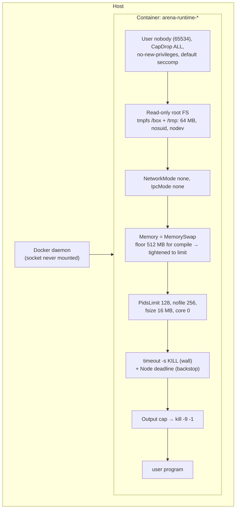
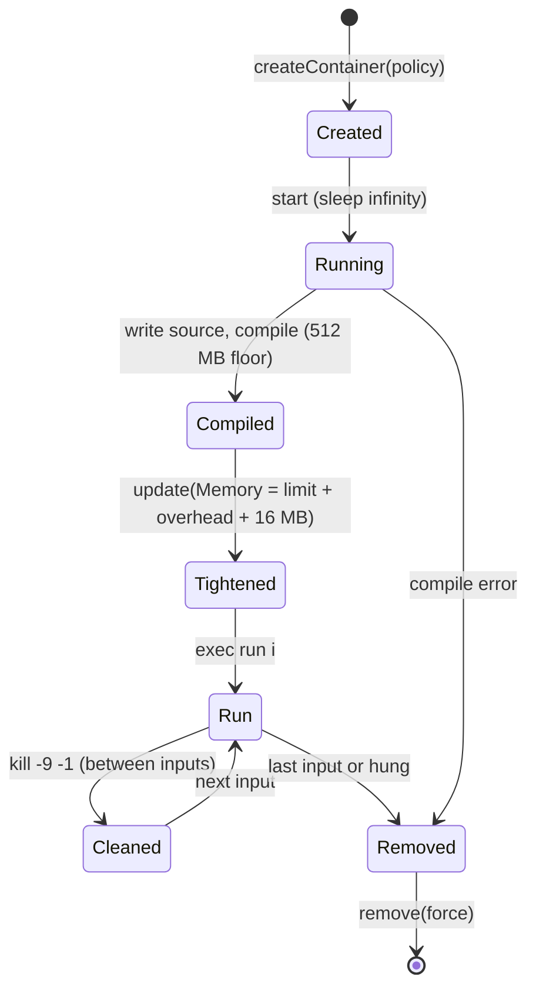

# Sandbox layers (Chapter 5)

```mermaid
flowchart TB
  subgraph Host
    D["Docker daemon<br/>(socket never mounted)"]
    subgraph C["Container: arena-runtime-*"]
      direction TB
      L1["User nobody (65534), CapDrop ALL,<br/>no-new-privileges, default seccomp"]
      L2["Read-only root FS<br/>tmpfs /box + /tmp: 64 MB, nosuid, nodev"]
      L3["NetworkMode none, IpcMode none"]
      L4["Memory = MemorySwap<br/>floor 512 MB for compile → tightened to limit"]
      L5["PidsLimit 128, nofile 256,<br/>fsize 16 MB, core 0"]
      L6["timeout -s KILL (wall)<br/>+ Node deadline (backstop)"]
      L7["Output cap → kill -9 -1"]
      P["user program"]
      L1 --> L2 --> L3 --> L4 --> L5 --> L6 --> L7 --> P
    end
    D --> C
  end
```

## Lifecycle of one sandbox

```mermaid
stateDiagram-v2
  [*] --> Created: createContainer(policy)
  Created --> Running: start (sleep infinity)
  Running --> Compiled: write source, compile (512 MB floor)
  Compiled --> Tightened: update(Memory = limit + overhead + 16 MB)
  Tightened --> Run: exec run i
  Run --> Cleaned: kill -9 -1 (between inputs)
  Cleaned --> Run: next input
  Run --> Removed: last input or hung
  Running --> Removed: compile error
  Removed --> [*]: remove(force)
```
