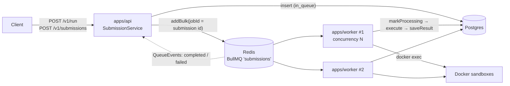
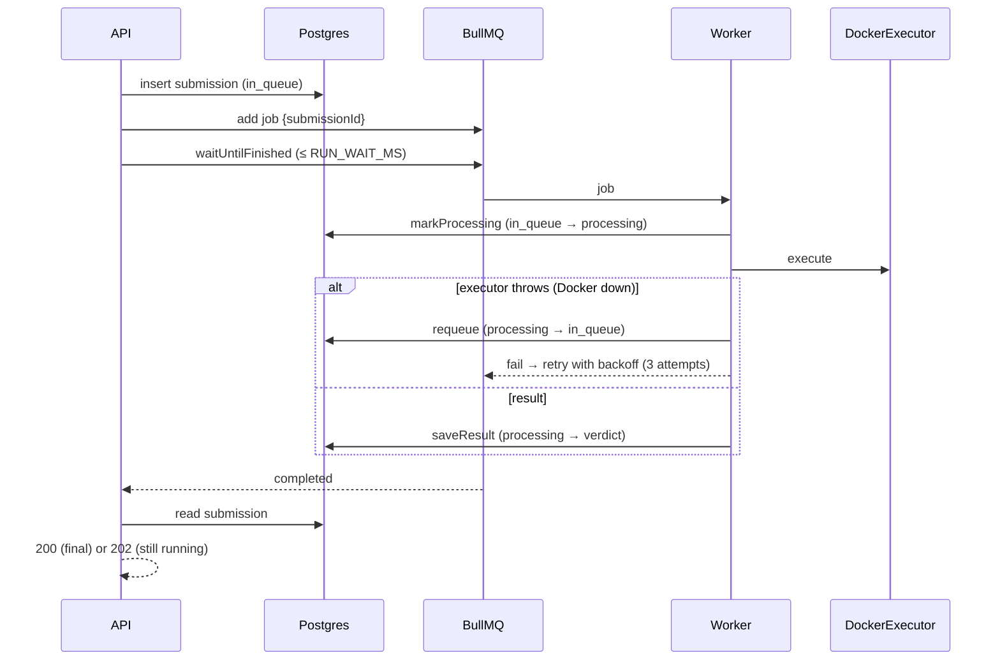
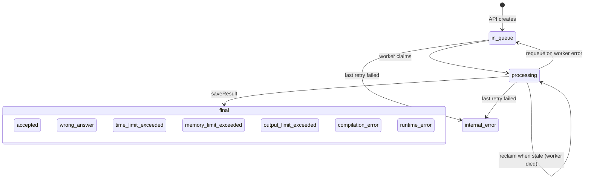

# Queue flow (Chapter 6)

```mermaid
flowchart LR
  C["Client"] -- "POST /v1/run<br/>POST /v1/submissions" --> API["apps/api<br/>SubmissionService"]
  API -- "insert (in_queue)" --> PG[("Postgres")]
  API -- "addBulk(jobId = submission id)" --> R[("Redis<br/>BullMQ 'submissions'")]
  R --> W1["apps/worker #1<br/>concurrency N"]
  R --> W2["apps/worker #2"]
  W1 -- "markProcessing → execute → saveResult" --> PG
  W1 -- "docker exec" --> D["Docker sandboxes"]
  W2 --> PG
  W2 --> D
  R -. "QueueEvents: completed / failed" .-> API
```

```mermaid
sequenceDiagram
  participant API
  participant PG as Postgres
  participant Q as BullMQ
  participant W as Worker
  participant EX as DockerExecutor

  API->>PG: insert submission (in_queue)
  API->>Q: add job {submissionId}
  API->>Q: waitUntilFinished (≤ RUN_WAIT_MS)
  Q->>W: job
  W->>PG: markProcessing (in_queue → processing)
  W->>EX: execute
  alt executor throws (Docker down)
    W->>PG: requeue (processing → in_queue)
    W-->>Q: fail → retry with backoff (3 attempts)
  else result
    W->>PG: saveResult (processing → verdict)
  end
  Q-->>API: completed
  API->>PG: read submission
  API-->>API: 200 (final) or 202 (still running)
```

## Lifecycle

```mermaid
stateDiagram-v2
  [*] --> in_queue: API creates
  in_queue --> processing: worker claims
  processing --> in_queue: requeue on worker error
  processing --> processing: reclaim when stale (worker died)
  processing --> final: saveResult
  in_queue --> internal_error: last retry failed
  processing --> internal_error: last retry failed
  state final {
    accepted
    wrong_answer
    time_limit_exceeded
    memory_limit_exceeded
    output_limit_exceeded
    compilation_error
    runtime_error
  }
```
