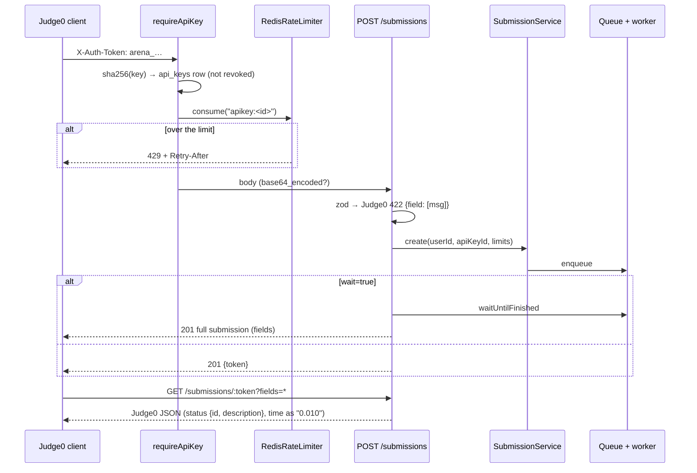
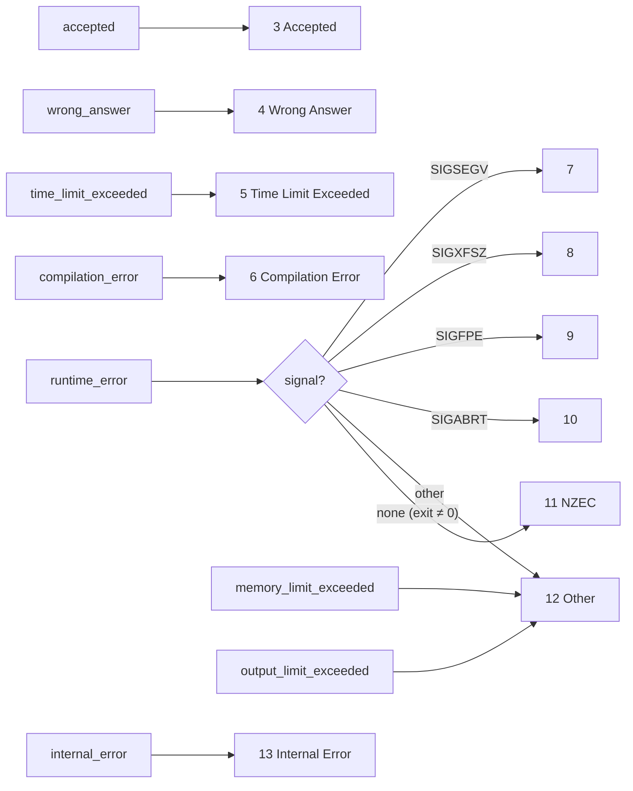

# Judge0-compatible API (Chapter 7)

```mermaid
sequenceDiagram
  participant Client as Judge0 client
  participant MW as requireApiKey
  participant RL as RedisRateLimiter
  participant R as POST /submissions
  participant S as SubmissionService
  participant Q as Queue + worker

  Client->>MW: X-Auth-Token: arena_…
  MW->>MW: sha256(key) → api_keys row (not revoked)
  MW->>RL: consume("apikey:<id>")
  alt over the limit
    RL-->>Client: 429 + Retry-After
  end
  MW->>R: body (base64_encoded?)
  R->>R: zod → Judge0 422 {field: [msg]}
  R->>S: create(userId, apiKeyId, limits)
  S->>Q: enqueue
  alt wait=true
    R->>Q: waitUntilFinished
    R-->>Client: 201 full submission (fields)
  else
    R-->>Client: 201 {token}
  end
  Client->>R: GET /submissions/:token?fields=*
  R-->>Client: Judge0 JSON (status {id, description}, time as "0.010")
```

## Status mapping

```mermaid
flowchart LR
  A[accepted] --> J3["3 Accepted"]
  WA[wrong_answer] --> J4["4 Wrong Answer"]
  TLE[time_limit_exceeded] --> J5["5 Time Limit Exceeded"]
  CE[compilation_error] --> J6["6 Compilation Error"]
  RE[runtime_error] --> SIG{signal?}
  SIG -- SIGSEGV --> J7["7"]
  SIG -- SIGXFSZ --> J8["8"]
  SIG -- SIGFPE --> J9["9"]
  SIG -- SIGABRT --> J10["10"]
  SIG -- other --> J12["12 Other"]
  SIG -- "none (exit ≠ 0)" --> J11["11 NZEC"]
  MLE[memory_limit_exceeded] --> J12
  OLE[output_limit_exceeded] --> J12
  IE[internal_error] --> J13["13 Internal Error"]
```
