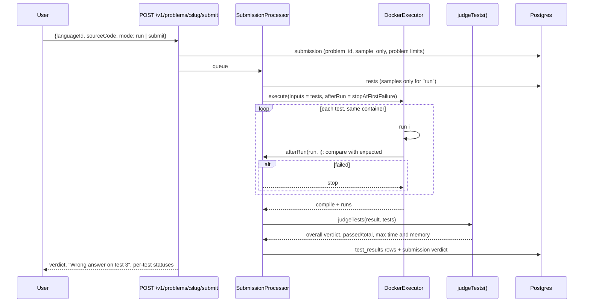
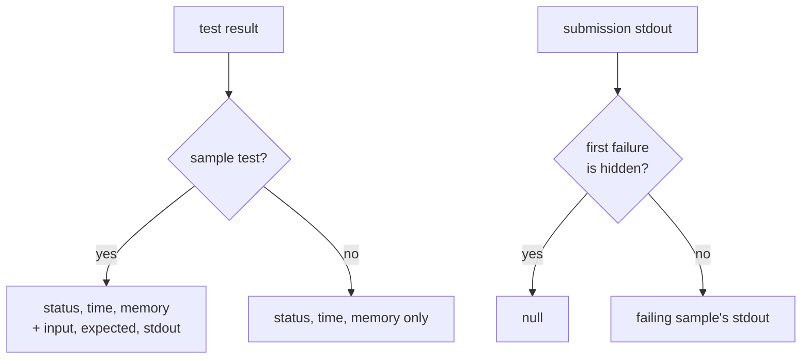
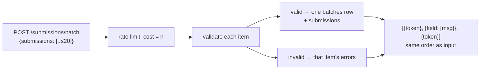

# Judging a problem submission (Chapter 8)

```mermaid
sequenceDiagram
  participant U as User
  participant API as POST /v1/problems/:slug/submit
  participant W as SubmissionProcessor
  participant EX as DockerExecutor
  participant J as judgeTests()
  participant DB as Postgres

  U->>API: {languageId, sourceCode, mode: run | submit}
  API->>DB: submission (problem_id, sample_only, problem limits)
  API->>W: queue
  W->>DB: tests (samples only for "run")
  W->>EX: execute(inputs = tests, afterRun = stopAtFirstFailure)
  loop each test, same container
    EX->>EX: run i
    EX->>W: afterRun(run, i): compare with expected
    alt failed
      W-->>EX: stop
    end
  end
  EX-->>W: compile + runs
  W->>J: judgeTests(result, tests)
  J-->>W: overall verdict, passed/total, max time and memory
  W->>DB: test_results rows + submission verdict
  API-->>U: verdict, "Wrong answer on test 3", per-test statuses
```

## What a user can see

```mermaid
flowchart TD
  T["test result"] --> S{"sample test?"}
  S -- yes --> Y["status, time, memory<br/>+ input, expected, stdout"]
  S -- no --> N["status, time, memory only"]
  F["submission stdout"] --> H{"first failure<br/>is hidden?"}
  H -- yes --> X["null"]
  H -- no --> O["failing sample's stdout"]
```

## Judge0 batch

```mermaid
flowchart LR
  B["POST /submissions/batch<br/>{submissions: [..≤20]}"] --> RL["rate limit: cost = n"]
  RL --> V["validate each item"]
  V --> OK["valid → one batches row<br/>+ submissions"]
  V --> ERR["invalid → that item's errors"]
  OK --> R["[{token}, {field: [msg]}, {token}]<br/>same order as input"]
  ERR --> R
```
