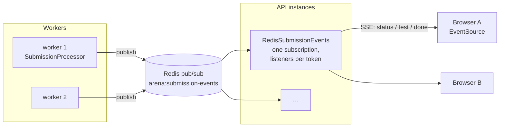
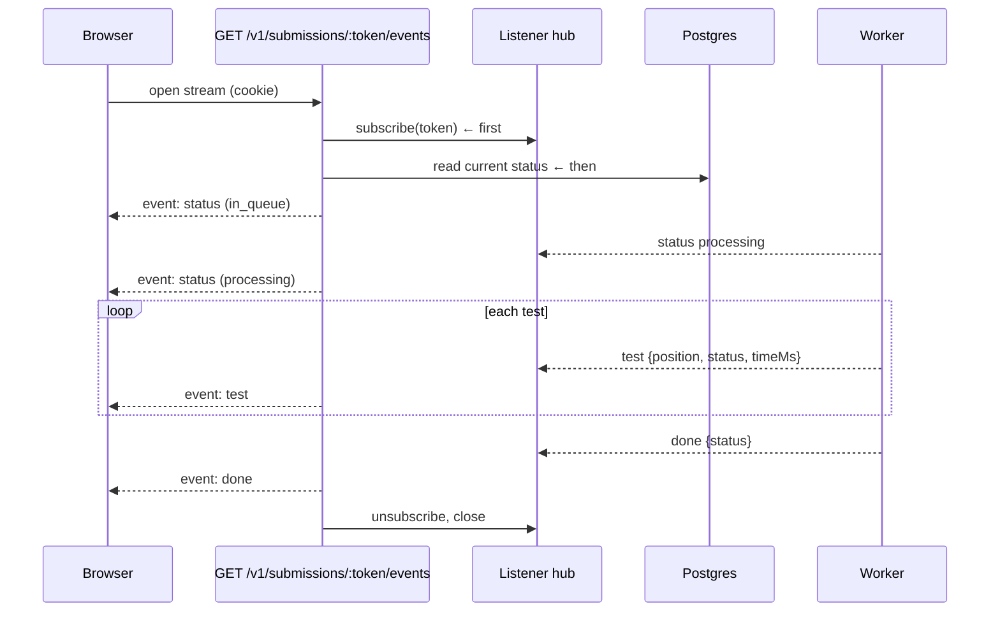

# Real-time results (Chapter 9)

```mermaid
flowchart LR
  subgraph Workers
    W1["worker 1<br/>SubmissionProcessor"]
    W2["worker 2"]
  end
  R[("Redis pub/sub<br/>arena:submission-events")]
  subgraph API["API instances"]
    A1["RedisSubmissionEvents<br/>one subscription,<br/>listeners per token"]
    A2["…"]
  end
  B1["Browser A<br/>EventSource"]
  B2["Browser B"]
  W1 -- publish --> R
  W2 -- publish --> R
  R --> A1
  R --> A2
  A1 -- "SSE: status / test / done" --> B1
  A1 --> B2
```

```mermaid
sequenceDiagram
  participant B as Browser
  participant API as GET /v1/submissions/:token/events
  participant H as Listener hub
  participant DB as Postgres
  participant W as Worker

  B->>API: open stream (cookie)
  API->>H: subscribe(token)  ← first
  API->>DB: read current status ← then
  API-->>B: event: status (in_queue)
  W-->>H: status processing
  API-->>B: event: status (processing)
  loop each test
    W-->>H: test {position, status, timeMs}
    API-->>B: event: test
  end
  W-->>H: done {status}
  API-->>B: event: done
  API->>H: unsubscribe, close
```

If the submission is already final when the stream opens, the API sends
`status` and `done` immediately and closes.
