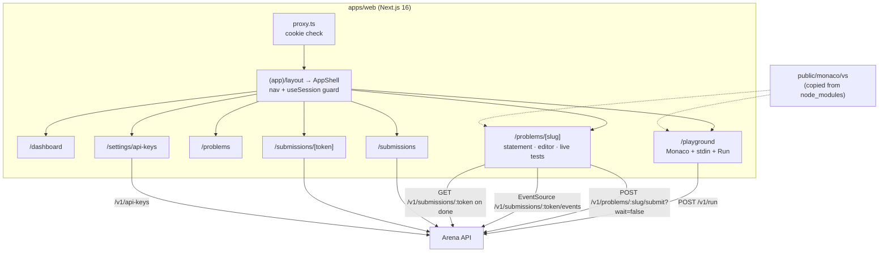
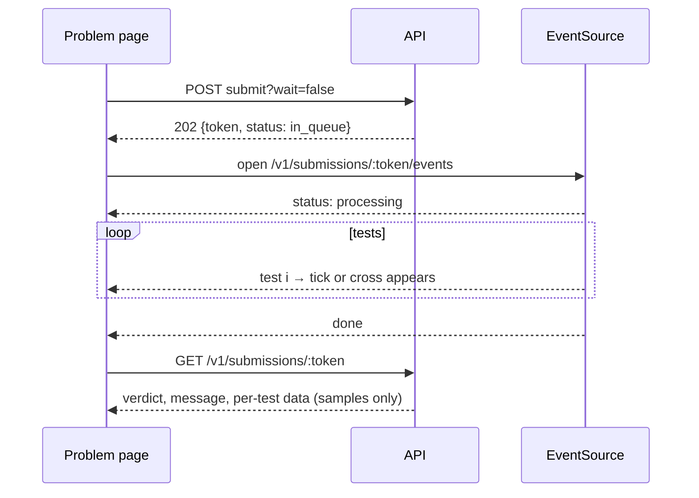

# Web app (Chapter 10)

```mermaid
flowchart TD
  subgraph Next["apps/web (Next.js 16)"]
    P["proxy.ts<br/>cookie check"] --> SH["(app)/layout → AppShell<br/>nav + useSession guard"]
    SH --> D["/dashboard"]
    SH --> PG["/playground<br/>Monaco + stdin + Run"]
    SH --> PL["/problems"]
    SH --> PD["/problems/[slug]<br/>statement · editor · live tests"]
    SH --> SL["/submissions"]
    SH --> SD["/submissions/[token]"]
    SH --> AK["/settings/api-keys"]
  end
  M["public/monaco/vs<br/>(copied from node_modules)"] -.-> PG
  M -.-> PD
  PG -- "POST /v1/run" --> API["Arena API"]
  PD -- "POST /v1/problems/:slug/submit?wait=false" --> API
  PD -- "EventSource /v1/submissions/:token/events" --> API
  PD -- "GET /v1/submissions/:token on done" --> API
  SL & SD --> API
  AK -- "/v1/api-keys" --> API
```

## Submit with live progress

```mermaid
sequenceDiagram
  participant UI as Problem page
  participant API
  participant SSE as EventSource

  UI->>API: POST submit?wait=false
  API-->>UI: 202 {token, status: in_queue}
  UI->>SSE: open /v1/submissions/:token/events
  SSE-->>UI: status: processing
  loop tests
    SSE-->>UI: test i → tick or cross appears
  end
  SSE-->>UI: done
  UI->>API: GET /v1/submissions/:token
  API-->>UI: verdict, message, per-test data (samples only)
```
