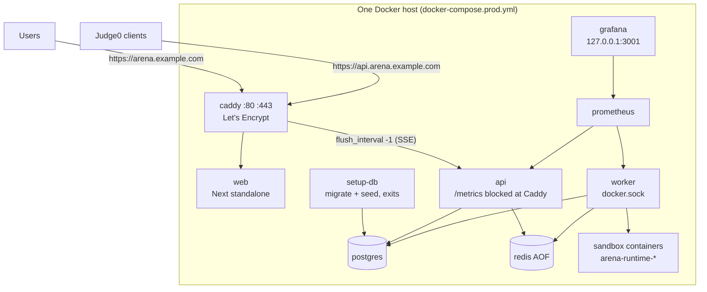
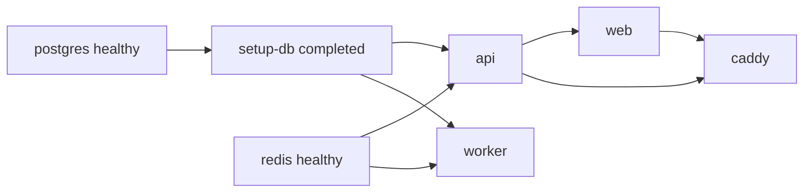
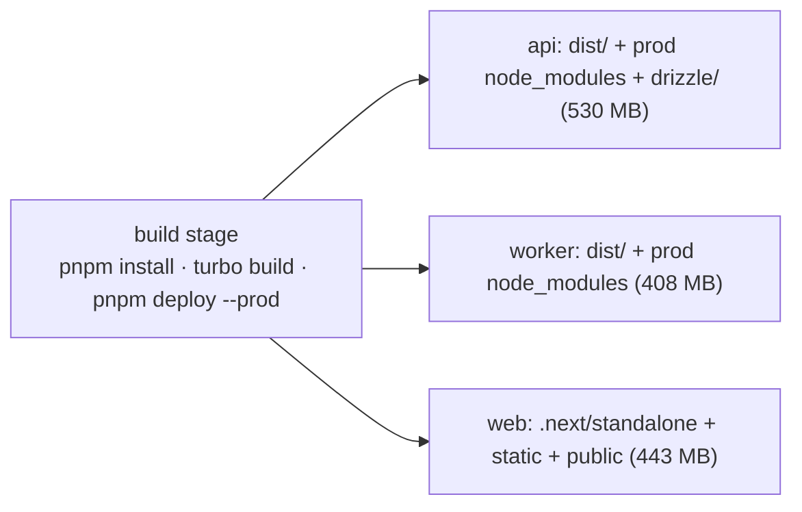

# Production deployment (Chapter 12)

```mermaid
flowchart TB
  U["Users"] -- "https://arena.example.com" --> CD
  C["Judge0 clients"] -- "https://api.arena.example.com" --> CD
  subgraph Host["One Docker host (docker-compose.prod.yml)"]
    CD["caddy :80 :443<br/>Let's Encrypt"]
    WEB["web<br/>Next standalone"]
    API["api<br/>/metrics blocked at Caddy"]
    WK["worker<br/>docker.sock"]
    SDB["setup-db<br/>migrate + seed, exits"]
    PG[("postgres")]
    RD[("redis AOF")]
    PR["prometheus"]
    GF["grafana<br/>127.0.0.1:3001"]
    SB["sandbox containers<br/>arena-runtime-*"]
    CD --> WEB
    CD -- "flush_interval -1 (SSE)" --> API
    SDB --> PG
    API --> PG & RD
    WK --> PG & RD
    WK --> SB
    PR --> API & WK
    GF --> PR
  end
```

## Start order

```mermaid
flowchart LR
  PG["postgres healthy"] --> S["setup-db completed"]
  RD["redis healthy"] --> A["api"]
  S --> A
  S --> W["worker"]
  RD --> W
  A --> WEB["web"]
  WEB --> C["caddy"]
  A --> C
```

## Images (one Dockerfile, three targets)

```mermaid
flowchart LR
  B["build stage<br/>pnpm install · turbo build · pnpm deploy --prod"]
  B --> API["api: dist/ + prod node_modules + drizzle/ (530 MB)"]
  B --> W["worker: dist/ + prod node_modules (408 MB)"]
  B --> WEB["web: .next/standalone + static + public (443 MB)"]
```
